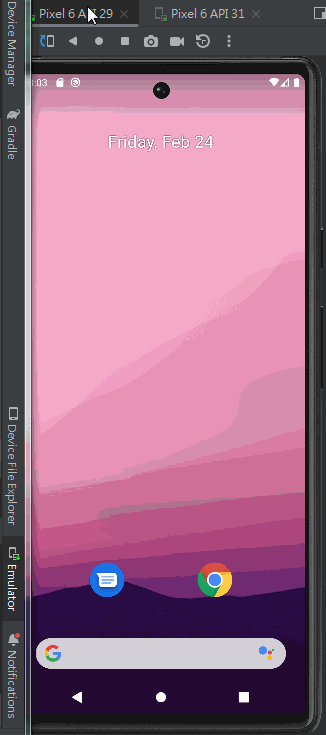

# thingsboard_app

A new Android Kotlin project.

## Getting Started

This project is a starting point for a Android Kotlin application.

A few resources to get you started if this is your first Android Kotlin project:

- [Android Basics in Kotlin](https://developer.android.com/courses/android-basics-kotlin/course)
- [Create your first Android app](https://developer.android.com/courses/pathways/android-basics-kotlin-two) 

## Learn More
- [ThingsBoard REST API](https://thingsboard.io/docs/reference/rest-api/)
- [Material Components](https://m2.material.io/components?platform=android)
- [Importing an SVG or PSD file](https://developer.android.com/studio/write/vector-asset-studio#svg)
- [Retrofit](https://square.github.io/retrofit/)
- [Coroutine](https://kotlinlang.org/docs/coroutines-overview.html)
- [Gson](https://github.com/google/gson)
- [Navigation component](https://developer.android.com/guide/navigation/navigation-getting-started)

## Demo
 
